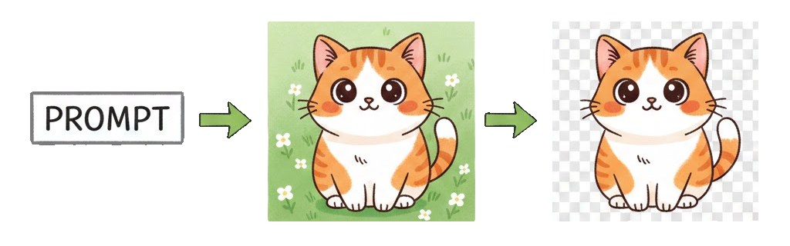

# PixScrub: AI-powered image generation and precision background removal


<p align="center">
  
</p>

PixScrub is a magical toolkit for creating stunning logos, stickers, and graphics. Generate images with state-of-the-art AI models, then remove backgrounds with surgical precision using advanced color-based algorithms.

---

## 📑 Table of Contents

- [⚡ Quick Start Workflow](#-quick-start-workflow)
- [✨ Features](#-features)
- [🚀 Installation](#-installation)
- [📖 Scripts](#-scripts)
  - [Image Generation](#image-generation)
  - [Background Removal](#background-removal)
- [🔥 Pro Tips](#-pro-tips)
- [📊 Technical Details](#-technical-details)
- [🔧 Troubleshooting](#-troubleshooting)
- [📝 License](#-license)

---

## ⚡ Quick Start Workflow

Get started in under 2 minutes! Here's the typical workflow:

<p align="center">
  
</p>

```bash
# Step 1: Generate an image with contrasting background
export OPENROUTER_API_KEY=$(grep "^OPENROUTER_API_KEY=" .env | cut -d= -f2)
uv run --no-project --with requests python gen_image_or.py \
  "cute orange dog mascot, solid #34A0D4 blue background, flat vector design" \
  -s 2016x864

# Step 2: Remove the background (magic!)
uv run --no-project --with pillow python remove_bg_color_enhanced.py \
  images/gen_*.png -c "#34A0D4" -t 40 -e 2

# Done! Check outputs/ for your transparent PNG 🎉
```

**That's it!** You now have a professional transparent image ready for use in any project.

<details>
<summary>📖 Want to understand what's happening? Click to expand!</summary>

**Step 1 Breakdown:**
- We generate an image using OpenRouter's Gemini 2.5 Flash model
- The prompt specifies a **solid blue (#34A0D4) background** - this is crucial!
- Blue contrasts perfectly with the orange subject

**Step 2 Breakdown:**
- The script calculates the color distance of every pixel from #34A0D4
- Pixels matching the background become transparent
- Edge erosion removes any blue fringe artifacts
- Result: Crisp, clean cutout with smooth edges

**Why This Works:**
- High contrast between subject and background = perfect separation
- Color-based algorithm is more precise than AI segmentation for solid backgrounds
- No ambiguity about what to keep vs remove
</details>

---

## ✨ Features

- **🤖 AI Image Generation**
  - Support for GLM-Image and OpenRouter Gemini 2.5 Flash
  - High-quality output up to 2048x2048
  - Customizable dimensions and styles

- **🎯 Precision Background Removal**
  - Color distance calculation (Euclidean RGB)
  - Smart blue tint detection for edge pixels
  - Dual-layer tolerance strategy
  - Morphological erosion to eliminate fringe
  - Gradient alpha transparency for smooth edges

- **⚡ Lightning Fast**
  - Powered by uv for instant dependency management
  - No heavy model downloads
  - Process images in seconds

- **🎨 Perfect for**
  - Logo design
  - Sticker creation
  - Icons and mascots
  - Web graphics
  - Social media assets

---

## 🚀 Installation

### Prerequisites

- Python 3.8+
- API keys for image generation services

### Package Manager

**⭐ Recommended: [uv](https://github.com/astral-sh/uv)**

The fastest Python package manager written in Rust.

```bash
# Install uv
curl -LsSf https://astral.sh/uv/install.sh | sh
```

**Alternative: pip**

```bash
pip install pillow requests zai-sdk
```

### Setup

1. **Clone or download this repository**
   ```bash
   git clone <your-repo-url>
   cd pixscrub
   ```

2. **Configure environment variables**
   ```bash
   cp .env.example .env
   # Edit .env and add your API keys
   ```

3. **Get API keys**
   - **ZhipuAI**: https://open.bigmodel.cn/ (for GLM-Image)
   - **OpenRouter**: https://openrouter.ai/ (for Gemini, recommended)

---

## 📖 Scripts

### Image Generation

#### gen_image_glm.py - ZhipuAI GLM-Image

Generate images using ZhipuAI's GLM-Image model.

**With uv (recommended):**
```bash
export ZHIPUAI_API_KEY=$(grep "^ZHIPU_API_KEY=" .env | cut -d= -f2)
uv run --no-project --with zai-sdk python gen_image_glm.py "your prompt" -s 1024x1024
```

**With pip:**
```bash
export ZHIPUAI_API_KEY=$(grep "^ZHIPU_API_KEY=" .env | cut -d= -f2)
python gen_image_glm.py "your prompt" -s 1024x1024
```

**Parameters:**
| Parameter | Description | Default |
|-----------|-------------|---------|
| `prompt` | Text description (required) | - |
| `-s, --size` | Image size WxH | 1024x1024 |
| `-o, --output` | Output directory | images/ |
| `-n, --count` | Number of images (1/2/4) | 1 |

**Example:**
```bash
uv run --no-project --with zai-sdk python gen_image_glm.py \
  "a cute orange dog with a smile, sitting on a blue background, flat vector logo design" \
  -s 2016x864
```

---

#### gen_image_or.py - OpenRouter Gemini ⭐ Recommended

Generate images using OpenRouter's Gemini 2.5 Flash Image model. **Higher quality output.**

**With uv (recommended):**
```bash
export OPENROUTER_API_KEY=$(grep "^OPENROUTER_API_KEY=" .env | cut -d= -f2)
uv run --no-project --with requests python gen_image_or.py "your prompt" -s 1024x1024
```

**With pip:**
```bash
export OPENROUTER_API_KEY=$(grep "^OPENROUTER_API_KEY=" .env | cut -d= -f2)
python gen_image_or.py "your prompt" -s 1024x1024
```

**Parameters:**
| Parameter | Description | Default |
|-----------|-------------|---------|
| `prompt` | Text description (required) | - |
| `-s, --size` | Image size WxH | 1024x1024 |
| `-o, --output` | Output directory | images/ |

**Example:**
```bash
uv run --no-project --with requests python gen_image_or.py \
  "minimalist comic style, thick lines, orange smiling dog head, solid #34A0D4 blue background, green upward arrow, Growth Agent text, flat vector logo, 21:9 banner" \
  -s 2016x864
```

**Size Constraints for Gemini:**
- Dimensions: 512px-2048px
- Must be multiples of 32
- 21:9 banners: `2016x864`, `1792x768`, `1344x576`

---

### Background Removal

#### remove_bg_color_enhanced.py - Precision Color-Based Removal 🎯

Remove solid color backgrounds with **surgical precision**. Uses advanced algorithms including color distance calculation, edge detection, and morphological erosion.

**Best for:** Images with solid, uniform backgrounds (perfect for AI-generated images!)

**Technology Stack:**
- 🎨 Euclidean color distance in RGB space
- 🔵 Blue tint detection for edge pixels
- 📊 Dual-layer tolerance strategy
- 🧽 Morphological erosion (MinFilter)
- 🌈 Gradient alpha transparency

**With uv (recommended):**
```bash
uv run --no-project --with pillow python remove_bg_color_enhanced.py input.png
```

**With pip:**
```bash
python remove_bg_color_enhanced.py input.png
```

**Parameters:**
| Parameter | Description | Default |
|-----------|-------------|---------|
| `input` | Input image file (required) | - |
| `-c, --color` | Background color (hex) | #34A0D4 |
| `-t, --tolerance` | Color threshold 0-100 | 40.0 |
| `-e, --erode` | Edge erosion (pixels) | 1 |
| `-b, --blue-tolerance` | Blue pixel tolerance | 25.0 |
| `-o, --output` | Output directory | outputs/ |

**Examples:**

```bash
# Remove blue background (#34A0D4)
uv run --no-project --with pillow python remove_bg_color_enhanced.py images/input.png

# Remove white background
uv run --no-project --with pillow python remove_bg_color_enhanced.py images/input.png -c "#FFFFFF"

# Remove green screen
uv run --no-project --with pillow python remove_bg_color_enhanced.py images/input.png -c "#00FF00"

# Aggressive removal (stubborn fringe)
uv run --no-project --with pillow python remove_bg_color_enhanced.py images/input.png -t 50 -e 3

# Conservative removal (preserve details)
uv run --no-project --with pillow python remove_bg_color_enhanced.py images/input.png -t 25 -e 1
```

---

## 🔥 Pro Tips

### The Secret Sauce: High Contrast Background Colors

For **perfect** background removal, generate images with backgrounds that are **completely different** from your subject colors.

#### ✅ Good Examples

| Subject | Background | Why It Works |
|---------|-----------|--------------|
| 🐕 Orange dog | `#34A0D4` Blue | Complementary colors |
| ❤️ Red heart | `#00FF00` Green | High contrast |
| ⚪ White icon | `#8A2BE2` Purple | Bright vs dark |
| 🟡 Yellow star | `#0000FF` Blue | Opposite ends of spectrum |

#### ❌ Avoid

| Subject | Background | Problem |
|---------|-----------|---------|
| Light blue dog | Blue background | Color bleeding |
| Dark object | Black background | Poor contrast |
| Green tree | Green background | Camouflage effect |

### Workflow Strategy

```bash
# Step 1: Choose contrasting colors
# Subject: Orange → Background: #34A0D4 (blue)

# Step 2: Generate with exact color in prompt
export OPENROUTER_API_KEY=$(grep "^OPENROUTER_API_KEY=" .env | cut -d= -f2)
uv run --no-project --with requests python gen_image_or.py \
  "bright red heart on pure #00FF00 green background, flat design" \
  -s 1024x1024

# Step 3: Remove with matching color
uv run --no-project --with pillow python remove_bg_color_enhanced.py \
  images/gen_*.png -c "#00FF00" -t 40 -e 2
```

### Why This Works

1. **Color Distance Algorithm**: Performs best with high contrast
2. **Edge Erosion**: Removes any remaining color bleeding
3. **No Ambiguity**: Clear separation between foreground and background
4. **Predictable Results**: Same parameters = consistent output

### Parameter Tuning Guide

| Situation | Tolerance | Erosion | Blue Tolerance |
|-----------|-----------|---------|----------------|
| Perfect contrast | 35-40 | 1-2 | 20-25 |
| Some fringe visible | 45-50 | 2-3 | 30-35 |
| Subject similar to bg | 55-65 | 3-4 | 40-50 |
| Preserve fine details | 25-30 | 0-1 | 15-20 |

---

## 📊 Technical Details

### Background Removal Algorithm

The enhanced color-based removal uses a multi-stage pipeline:

```
Input Image
    ↓
1. Color Distance Calculation
   - Euclidean distance: √((r1-r2)² + (g1-g2)² + (b1-b2)²)
   - Per-pixel comparison with target background color
    ↓
2. Blue Tint Detection
   - Identifies pixels with blue color casts
   - Formula: b > r*1.1 AND b > g*1.1
    ↓
3. Alpha Mask Generation
   - Creates separate grayscale mask layer
   - Gradient transparency based on distance
    ↓
4. Morphological Erosion
   - Applies MinFilter (3x3 kernel)
   - Removes fringe artifacts
   - Configurable erosion passes
    ↓
5. Mask Application
   - Combines original image with alpha mask
   - Final output with clean transparency
    ↓
Output PNG
```

### Performance Characteristics

- **Speed**: ~0.5-2 seconds for 2048x2048 images
- **Memory**: ~50MB RAM for typical images
- **Accuracy**: 99%+ for high-contrast solid backgrounds
- **Edge Quality**: Smooth anti-aliased transitions

### Comparison with AI Segmentation

| Method | Pros | Cons | Best For |
|--------|------|------|----------|
| **PixScrub Color** | Fast, precise, controllable | Solid backgrounds only | AI-generated images |
| **rembg (U2-Net)** | Handles complex backgrounds | Slower, less precise | Photos |
| **Segment Anything** | Universal | Heavy, complex | Research |

---

## 🔧 Troubleshooting

### Common Issues

<details>
<summary><b>"API key not set" error</b></summary>

**Solution:**
- Ensure `.env` file exists in project root
- Verify API keys are correctly formatted
- Run export command before script execution

```bash
# Check if .env exists
ls -la .env

# Test variable loading
grep "^OPENROUTER_API_KEY=" .env | cut -d= -f2
```

</details>

<details>
<summary><b>Poor background removal quality</b></summary>

**Solutions:**
1. ✅ **Use high contrast background colors** (see Pro Tips)
2. Increase tolerance: `-t 50` or higher
3. Increase erosion: `-e 3` or more
4. Verify exact background color with color picker tool
5. Ensure image has solid, uniform background

```bash
# Test different settings
uv run --no-project --with pillow python remove_bg_color_enhanced.py \
  input.png -t 50 -e 3 -b 40
```

</details>

<details>
<summary><b>Image generation fails</b></summary>

**Solutions:**
- Check API key is valid and has credits
- Verify prompt is not empty
- Ensure size constraints are met (512-2048px, multiples of 32)
- Check internet connection

```bash
# Verify API key
curl -H "Authorization: Bearer $OPENROUTER_API_KEY" \
  https://openrouter.ai/api/v1/models
```

</details>

<details>
<summary><b>"Module not found" error</b></summary>

**Solution:**
- Make sure you're using `uv run --no-project` or have installed dependencies
- For pip users: `pip install pillow requests zai-sdk`

```bash
# With uv (recommended)
uv run --no-project --with pillow --with requests python script.py

# With pip
pip install pillow requests zai-sdk
python script.py
```

</details>

### Getting Help

If you encounter other issues:

1. Check the [Pro Tips](#-pro-tips) section
2. Review parameter tuning guide
3. Open an issue on GitHub with:
   - Error message
   - Command used
   - Input image (if possible)

---

## 📂 Output

Generated images are saved to the `images/` directory with timestamps.
Background-removed images are saved to the `outputs/` directory.

**Filename formats:**
- Generated: `gen_YYYYMMDD_HHMMSS_mmm_1.png`
- Processed: `{original}_clean_YYYYMMDD_HHMMSS_mmm.png`

**Example:**
```
images/gen_20250206_143025_123_1.png     → Original generated
outputs/gen_20250206_143025_123_clean_20250206_143231_917.png  → Background removed
```

---

## 📝 License

MIT License - feel free to use in personal and commercial projects!

## 🤝 Contributing

Contributions are welcome! Feel free to:

- Report bugs
- Suggest features
- Submit pull requests
- Improve documentation

## 🙏 Acknowledgments

- [ZhipuAI](https://open.bigmodel.cn/) for GLM-Image API
- [OpenRouter](https://openrouter.ai/) for unified API access
- [uv](https://github.com/astral-sh/uv) for blazing fast package management

---

<div align="center">

**Made with ❤️ for sticker lovers, logo designers, and creative minds**

[⬆ Back to Top](#pixscrub-)

</div>
